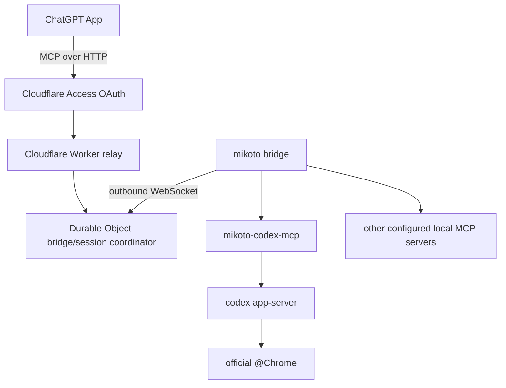
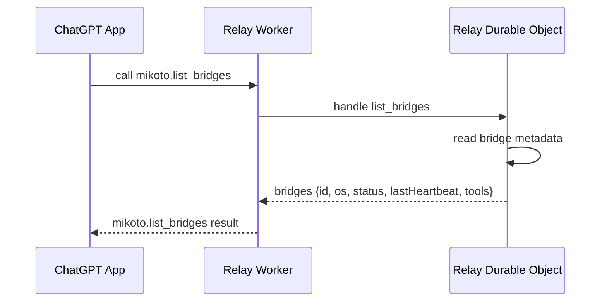

# mikoto

`mikoto` is an early-stage local MCP gateway for using ChatGPT with explicitly
configured local MCP servers through a Cloudflare relay.

The MVP goal is a general-purpose, read-only Codex browser read tool. ChatGPT
should be able to ask for structured information from an allowed local browser
context through Codex app-server and the official `@Chrome` integration, without
direct browser control, raw HTML/DOM access, cookies, storage, tokens, or raw
Codex app-server JSON-RPC.

## Status

This repository is currently in the design stage. There is no installable
package or runnable MVP yet.

Detailed implementation notes live in [design.md](design.md). That file is
temporary and should be removed once the implementation makes the design
concrete in code and stable README documentation.

## Intended Users

- Developers who already use Codex, MCP, Cloudflare, and local automation.
- Operators who want ChatGPT to summarize authenticated or local state without
  broad credential exposure.
- Power users who run multiple local MCP servers and want one ChatGPT-facing
  entrypoint.

## Architecture

- `relay`: Cloudflare Worker + Durable Object relay for the ChatGPT-facing MCP
  endpoint.
- `mikoto bridge`: local router that connects outbound to the relay and routes
  calls to configured backend MCP servers.
- `mikoto-codex-mcp`: standalone MCP server that owns Codex app-server
  integration.

The ChatGPT-facing MCP endpoint uses Streamable HTTP. The bridge connects
outbound to the relay over WebSocket. Configured local MCP servers sit behind
the bridge.

## Safety Model

The browser-read tool is general-purpose but read-only.

Browser read tools must not:

- Click, type, submit, navigate destructively, or mutate state.
- Inspect cookies, tokens, local storage, session storage, or other secrets.
- Return raw HTML, raw DOM dumps, screenshots, storage contents, or broad page
  dumps.

Tools should return structured, task-oriented data for the request.

## Setup

TODO after implementation: replace this section with exact commands.

Planned prerequisites:

- Bun
- mise
- Cloudflare account
- Cloudflare WARP on each local computer that will run `mikoto bridge`
- Cloudflare Access Managed OAuth for the ChatGPT-facing MCP endpoint
- Codex CLI available through `mise x codex@latest -- codex ...`

## Deployment

The Cloudflare relay should be deployed from GitHub Actions using
`cloudflare/wrangler-action` or a raw `wrangler deploy` command with a
Cloudflare API token.

Cloudflare Workers Builds are not used for this repository.

## Usage

TODO after implementation: replace with working commands.

Planned flow:

1. Deploy the Cloudflare relay.
2. Start `mikoto bridge` through the `bridge` mise task; it connects outbound to
   the relay.
3. Connect the ChatGPT App to the Access-protected Streamable HTTP MCP endpoint.
4. Call `mikoto.list_bridges`.
5. Call a configured tool or alias such as `local_chrome_read`.

## Configuration

Configuration starts as project-local `mikoto.toml` with schema validation.

The backend MCP server config schema includes both `stdio` and `http`
transports. The first implementation supports `stdio`; configured `http`
backends return a clear unimplemented error until support lands.

## Testing

Use Vitest for repository tests.

For Cloudflare Worker relay tests, use `@cloudflare/vitest-pool-workers` so
tests run locally in the Workers runtime through Miniflare/workerd.

Project commands are exposed as mise tasks.

Avoid browser/Codex end-to-end tests until the skeleton protocol and routing
behavior are stable.
