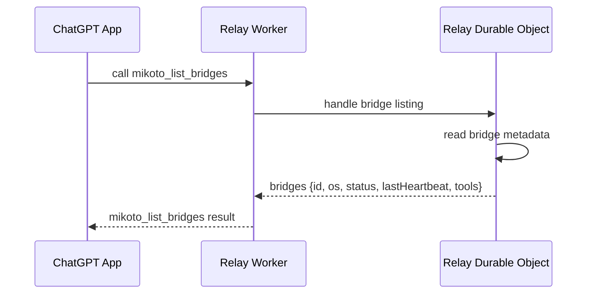

# mikoto

`mikoto` is an early-stage local MCP gateway for using ChatGPT with explicitly
configured local MCP servers through a Cloudflare relay.

The MVP goal is a general-purpose, read-only Codex browser read tool. ChatGPT
should be able to ask for structured information from an allowed local browser
context through bounded Codex CLI tasks and the official `@Chrome` integration,
without direct browser control, raw HTML/DOM access, cookies, storage, tokens,
or raw Codex internals.

## Status

This repository has an early local development path for the relay, bridge, and
Codex MCP server. The public deployment path is still incomplete, and
`design.md` remains the temporary detailed implementation note until the MVP is
stable.

## Intended Users

- Developers who already use Codex, MCP, Cloudflare, and local automation.
- Operators who want ChatGPT to summarize authenticated or local state without
  broad credential exposure.
- Power users who run multiple local MCP servers and want one ChatGPT-facing
  entrypoint.

## Architecture

- `relay`: Cloudflare Worker + Durable Object relay for the ChatGPT-facing MCP
  endpoint.
- `mikoto bridge`: local router that connects outbound to the relay and routes
  calls to configured backend MCP servers.
- `mikoto-codex-mcp`: standalone MCP server that owns bounded Codex CLI task
  execution.

The ChatGPT-facing MCP endpoint uses Streamable HTTP. The bridge connects
outbound to the relay over WebSocket. Configured local MCP servers sit behind
the bridge.




## Safety Model

The browser-read tool is general-purpose but read-only.

Browser read tools must not:

- Click, type, submit, navigate destructively, or mutate state.
- Inspect cookies, tokens, local storage, session storage, or other secrets.
- Return raw HTML, raw DOM dumps, screenshots, storage contents, or broad page
  dumps.

Tools should return structured, task-oriented data for the request.

## Setup

Local prerequisites:

- Bun
- mise
- Wrangler, provided through mise
- Codex CLI available through `mise x codex@latest -- codex ...` for Codex
  backend tasks

Install dependencies:

```sh
mise trust
mise install
bun install --frozen-lockfile
```

Create a local config:

```sh
cp mikoto.example.toml mikoto.toml
```

The example config connects the bridge to `ws://localhost:8787/bridge`, starts
`@mikoto/codex-mcp` as a stdio backend, exposes backend-prefixed tools such as
`codex.codex_check`, and adds the `local_chrome_read` alias.

## Local Development

Run the local relay in one shell:

```sh
mise run relay:dev
```

Wrangler serves the local Worker at `http://localhost:8787`. The ChatGPT-facing
MCP endpoint is `http://localhost:8787/mcp`, and the bridge WebSocket endpoint
is `ws://localhost:8787/bridge`.

Run the bridge in another shell:

```sh
mise run bridge
```

The bridge loads `mikoto.toml`, starts configured stdio backend MCP servers
eagerly, discovers their tools, connects outbound to the relay, and sends a
static tool snapshot. If the relay connection is lost, the bridge exits for the
MVP.

You can override local config without editing `mikoto.toml`:

```sh
MIKOTO_RELAY_URL=ws://localhost:8787/bridge mise run bridge
MIKOTO_BRIDGE_ID=my-dev-machine mise run bridge
```

Inspect connected bridges through the local MCP endpoint:

```sh
curl -s http://localhost:8787/mcp \
  -H 'content-type: application/json' \
  -H 'accept: application/json, text/event-stream' \
  -H 'mcp-protocol-version: 2025-06-18' \
  --data '{
    "jsonrpc": "2.0",
    "id": 1,
    "method": "tools/call",
    "params": {
      "name": "mikoto_list_bridges",
      "arguments": {}
    }
  }'
```

Inspect the ChatGPT-facing tool list:

```sh
curl -s http://localhost:8787/mcp \
  -H 'content-type: application/json' \
  -H 'accept: application/json, text/event-stream' \
  -H 'mcp-protocol-version: 2025-06-18' \
  --data '{"jsonrpc":"2.0","id":2,"method":"tools/list","params":{}}'
```

The relay exposes `mikoto_list_bridges` plus tools announced by connected
bridges. Local backend tools keep their backend-prefixed names, for example
`codex.codex_check`, `codex.codex_task`, and `codex.codex_chrome_read`. If one
connected bridge exposes a tool, callers can omit bridge selection. If multiple
bridges expose the same tool, callers must select one with MCP request
`_meta["mikoto/bridgeId"]`.

## Configuration

Configuration starts as project-local `mikoto.toml` with schema validation.

```toml
[bridge]
id = "dev-machine"

[relay]
url = "ws://localhost:8787/bridge"

[[servers]]
id = "codex"
transport = "stdio"
command = "bun"
args = ["packages/codex-mcp/src/index.ts"]

[[servers.aliases]]
name = "local_chrome_read"
target = "codex.codex_chrome_read"
```

Supported fields:

- `[bridge].id`: optional bridge identity. Defaults to the local computer name.
- `[relay].url`: relay WebSocket URL. Required.
- `[[servers]].id`: backend MCP id used as the tool-name prefix.
- `[[servers]].transport`: `stdio` is implemented. `http` is schema-supported
  but returns an unimplemented error in the bridge.
- `[[servers]].command`, `args`, `cwd`, `env`: stdio backend launch settings.
- `[[servers.aliases]]`: optional exposed aliases that route to another exposed
  tool.

Configured backend MCP servers are exposed by default. Tool names are prefixed
with the backend id, so backend tool `codex_check` from server `codex` becomes
`codex.codex_check`.

## Deployment

Cloudflare deployment is separate from local development.

Planned deployment prerequisites:

- Cloudflare account
- Cloudflare WARP on each local computer that will run `mikoto bridge`
- Cloudflare Access Managed OAuth for the ChatGPT-facing MCP endpoint
- A separate Cloudflare Access policy for the bridge WebSocket endpoint

Cloudflare Workers Builds are not used for this repository.

The Cloudflare relay should be deployed from GitHub Actions using
`cloudflare/wrangler-action` or a raw `wrangler deploy` command with a
Cloudflare API token:

```sh
mise run relay:deploy
```

## Usage

Local flow:

1. Start the local relay with `mise run relay:dev`.
2. Start `mikoto bridge` with `mise run bridge`.
3. Verify `mikoto_list_bridges` through the local MCP endpoint.
4. Verify configured tools with `tools/list`.
5. Call a configured tool such as `codex.codex_check` or `local_chrome_read`.

Deployed flow:

1. Deploy the Cloudflare relay.
2. Protect the ChatGPT-facing MCP endpoint with Cloudflare Access OAuth.
3. Protect the bridge WebSocket endpoint for local WARP clients.
4. Start `mikoto bridge` with `MIKOTO_RELAY_URL=wss://.../bridge`.
5. Connect the ChatGPT App to the Access-protected Streamable HTTP MCP endpoint.

## Testing

Use Vitest for repository tests.

For Cloudflare Worker relay tests, use `@cloudflare/vitest-pool-workers` so
tests run locally in the Workers runtime through Miniflare/workerd.

Project commands are exposed as mise tasks.

Avoid browser/Codex end-to-end tests until the skeleton protocol and routing
behavior are stable.
