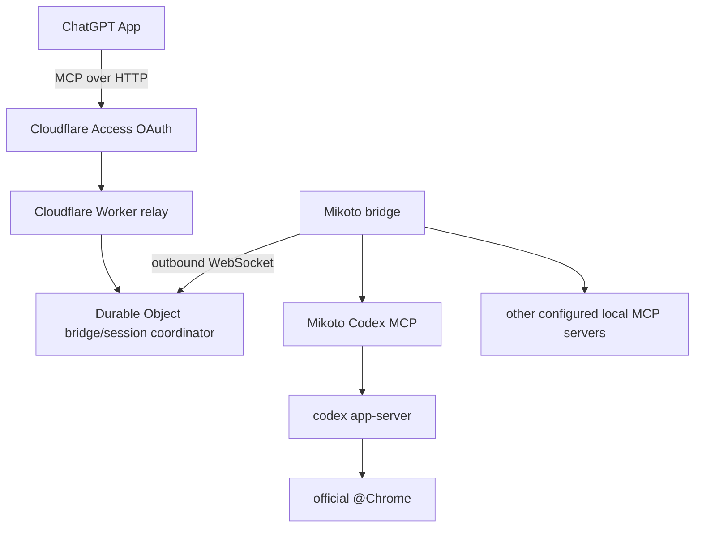
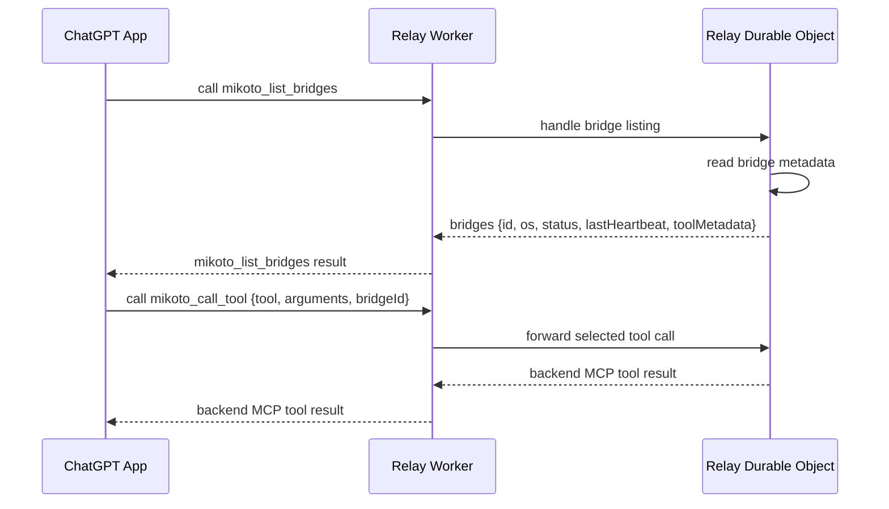

Mikoto is split into separate programs and packages:

- `relay`: Cloudflare Worker and Durable Object relay for the ChatGPT-facing MCP
  endpoint.
- Mikoto bridge: local router that connects outbound to the relay and routes
  calls to configured backend MCP servers.
- Mikoto Codex MCP: standalone MCP server that owns a local Codex app-server
  process and bounded Codex tool execution.
- `protocol`: shared schemas, relay and bridge messages, and config validation.

The ChatGPT-facing MCP endpoint uses Streamable HTTP. The bridge connects
outbound to the relay over WebSocket. Configured local MCP servers sit behind
the bridge.

## Bridge Metadata

The relay exposes a stable ChatGPT-facing tool set:

- `mikoto_list_bridges`: inspect safe bridge and tool metadata.
- `mikoto_call_tool`: call one backend tool by name after selecting it from
  bridge metadata.

Backend tools are not advertised as native ChatGPT tools. The bridge still
pushes tool metadata to the relay, and ChatGPT uses that metadata as the input
catalog for `mikoto_call_tool`.

This fixed tool set works around a ChatGPT Apps limitation: tool discovery is
not reliably refreshed for an already connected app session, so tools added
after a bridge connects may remain unavailable even when the relay advertises
them. Keeping the native MCP tool names stable lets ChatGPT keep using the same
tools while Mikoto refreshes backend tool metadata through
`mikoto_list_bridges`.

The relay returns only safe metadata: bridge id, bridge OS, status, last
heartbeat time, exposed tool names, and tool input schemas. It must not return
secrets, local paths, environment variables, raw backend config, raw tool
arguments, or historical tool results.

## Component Details

- [Relay](/parts/relay/) owns remote MCP routing and Durable Object session
  coordination.
- [Bridge](/parts/bridge/) owns local backend startup, discovery, and routing.
- [Codex MCP](/parts/codex-mcp/) owns Codex app-server execution and
  backend-specific read-only browser policy.
