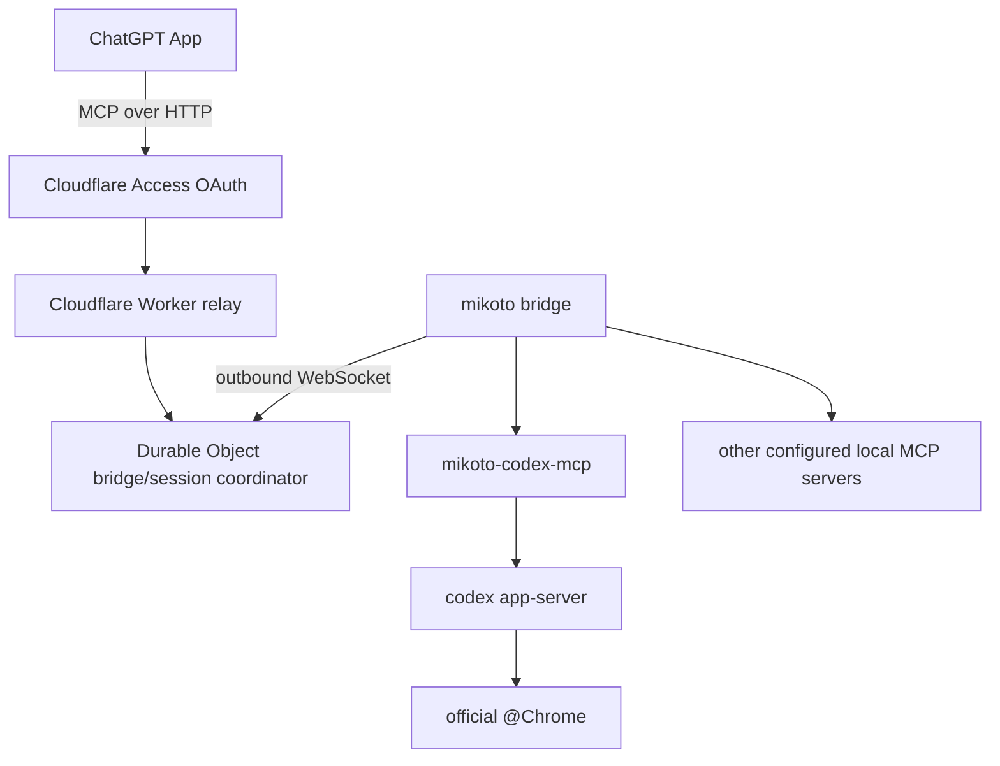
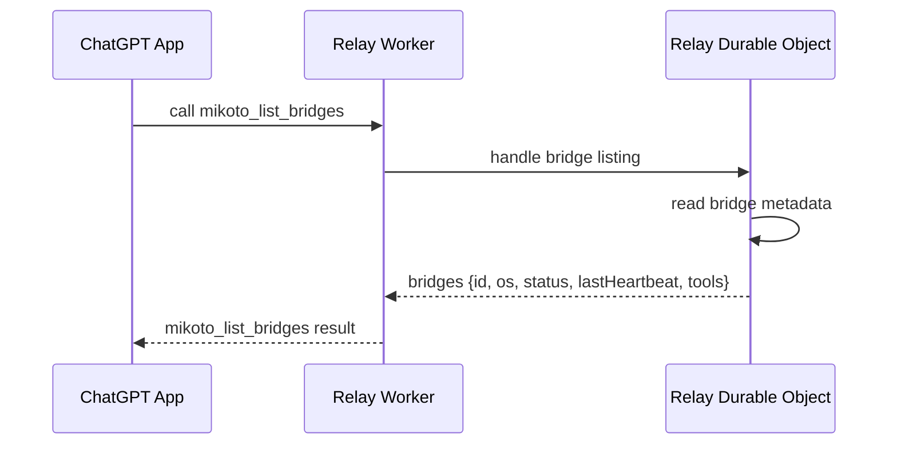

`mikoto` is split into separate programs and packages:

- `relay`: Cloudflare Worker and Durable Object relay for the ChatGPT-facing MCP
  endpoint.
- `mikoto bridge`: local router that connects outbound to the relay and routes
  calls to configured backend MCP servers.
- `mikoto-codex-mcp`: standalone MCP server that owns a local Codex app-server
  process and bounded Codex tool execution.
- `protocol`: shared schemas, relay and bridge messages, and config validation.

The ChatGPT-facing MCP endpoint uses Streamable HTTP. The bridge connects
outbound to the relay over WebSocket. Configured local MCP servers sit behind
the bridge.

## Bridge Metadata

The relay exposes `mikoto_list_bridges` so ChatGPT can inspect safe bridge and
tool metadata before selecting a local target.

The relay returns only safe metadata: bridge id, bridge OS, status, last
heartbeat time, and exposed tool names. It must not return secrets, local paths,
environment variables, raw backend config, raw tool arguments, or tool results.

## Component Details

- [Relay](/parts/relay/) owns remote MCP routing and Durable Object session
  coordination.
- [Bridge](/parts/bridge/) owns local backend startup, discovery, and routing.
- [Codex MCP](/parts/codex-mcp/) owns Codex app-server execution and
  backend-specific read-only browser policy.
